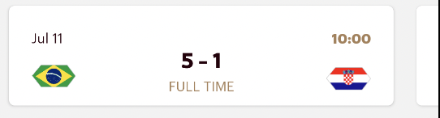
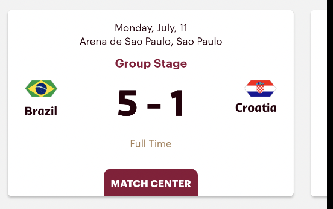
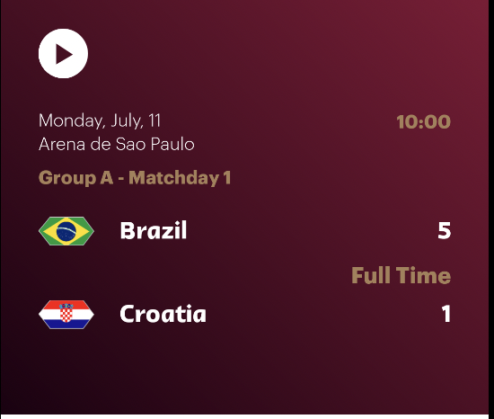
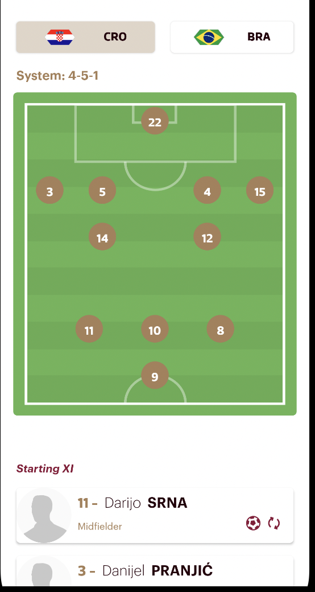

# React native widgets example.

## Matches
There are four types of match widgets
- SmallMatches

- MediumMatches

- LargeMatches

- ExpandedMatches


```
<SmallMatches data={{ groupId: "255933"}} style={styles.smallMatches} />
<MediumMatches data={{ teamId: "43960"}} style={styles.mediumMatches} />
<LargeMatches data={{ roundId: "255951"}} style={styles.largeMatches} />
<ExpandedMatches data={{ roundId: "255951"}} style={styles.expanedMatches} />
```

It supports 4 types of data:
**Match id**, display matches for given round id:

```
<SmallMatches data={{matchId: "84872}} style={styles.smallMatches} />
```
**Round id**, display matches for given round:
```
<SmallMatches data={{roundId: "255951}} style={styles.smallMatches} />
```

**Group id**, display matches for given group:
```
<SmallMatches data={{roundId: "255933}} style={styles.smallMatches} />
```

**Team id**, display matches for given team:
```
<SmallMatches data={{roundId: "43960}} style={styles.smallMatches} />
```

## TopPlayer Stats widget

This widget display top players from given team for selected stats.
Supported stats type: **goals**, **shots**

```
<TopPlayerStats data={{ teamId: "43948", statsType: "goals" }} style={styles.topPlayerStats} />
```


## Team Matches Stats widget

This widget display stats of matches played by given team (by team id).
```
<TeamMatchesStats teamId="43960" style={styles.teamMatchesStats} />
```

## Standings widget.
This widget is used to display standings. It can display standings for all groups as carousel,
and for single group by group id. There are to display modes: **compact** and **expanded**

You can provide groupdId to display single group, if no group id provided all groups are displayed.
Display mode configured by **isExpanded** field. If it true widget is expanded, otherwise it is compact.


```
<Standings data={{ groupId: "255933", isExpanded: true }} style={styles.standings} />
<Standings data={{ isExpanded: false }} style={styles.standings} />
```

## Championship widget.
This widget displays all rounds data as carousel. It not requires any parameters


```<Championship  style={styles.championship} />
```

## Match center widgets.
When user clicks on matchbox it displays popup with match details by default.
You can handle clicks by yourself, and use separated widgets.
There are three widgets.
- Match Header
- Lineup
- Match Stats

#### Match header
Header of match center



```
<MatchHeader data={{ matchId: "84872"}} style={styles.matchHeader} />
```
If you want also display actions inside it use Expanded match header
```

<ExpandedMatchHeader  data={{ matchId: "84872"}} style={styles.expandedMatchHeader} />
```

#### Lineup
Display lineup for given match



```
<Lineup data={{ matchId: "84872"}} style={styles.lineup} />
```

#### Match Stats
Displays match stats for given match


```
<MatchStats data={{ matchId: "84872"}} style={styles.matchStats} />
```

## Actions
This widget displays match highlights as carousel
```
<Actions data={{ matchId: "84872"}} style={styles.actions} />
```

## Favorites
This widget display list of teams and allow user to change favorite team.
It does not require any parameters
```
<Favorites style={styles.favorites} />
```

## Squad
This widget is used to display team squad for given team.
```
<Squad data={{ teamId: "43960" }} style={styles.actions} />
```
## Videos
This widget displays list of videos as carousel for given category and (optional) subcategory.
```
<Videos data={{ category: "Matches - Match Clips", subcategory: "TODO" }} style={styles.actions} />
```

## Head to Head
This widget display head to head comparision for two teams.
You can preselect two teams, in this case user is not able to change it.
```
<HeadToHead data={{ teamId1: "43960", teamId2: "43948" }} style={styles.headToHead} />
```

You can preselect one team, in this case user will be able to change second team by himself
```
<HeadToHead data={{ teamId: "43960" }} style={styles.headToHead} />
```

You can preselect no teams, in this case user will be able to select any team for both teams.
```
<HeadToHead data = {{}} style={styles.headToHead} />
```

## Team Board
This widget display info about team, it contains team standings, matches, stats.
You can allow or forbid user to change selected team.
```
// user is allowed to change team
<TeamBoard data={{ teamId: "43948", allowChangeTeam: true }} style={styles.teamBoard} />
// user is not allowed to change team.
<TeamBoard data={{ teamId: "43948" }} style={styles.teamBoard} />
```

## Venue
This widget display list of venues as carousel. It does not require any parameters.
```
<Venue style={styles.venue} />
```

## Watch
This widget display carousel of special match view.
Top part contains match info and open match center when user clicks on it
Bottom part contains video info and launch video player.


Like matches widget it can be configured using **matchId**, **groupId**, **teamId** or **roundId**
```
<Watch data = {{ teamId: "43960" }} style={styles.watch} />
<Watch data = {{ groupId: "255933" }} style={styles.watch} />
<Watch data = {{ roundId: "255951" }} style={styles.watch} />
<Watch data = {{ matchId: "84872" }} style={styles.watch} />
```

## TeamList
This widget display list of teams.

```
<TeamList style={styles.teamlist} />
```
